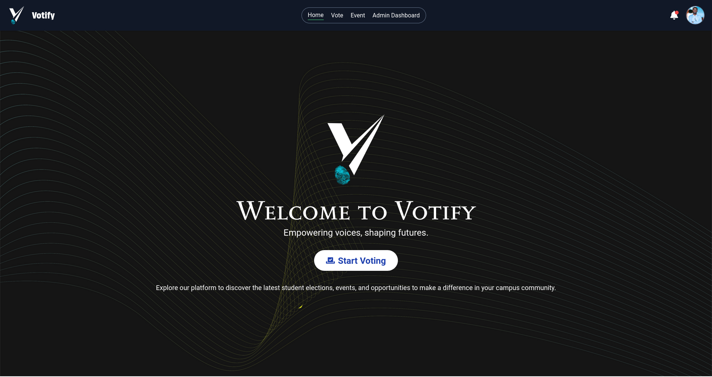

# Votify
Votify is the official voting platform for Madda Walabu University students as final year graduation project. Our platform is designed to empower students to actively participate in the democratic process by electing their representatives for various positions within the student union.

At Votify, we believe that every student's voice matters, and we are committed to providing a transparent and accessible platform for students to voice their opinions and shape the future of their university community.

# How it Works
```bash
 - user login into hes/her account using hes/her credentials
 - Navigate to the voting page where user can see a list of candidates
 - select there choice candidate on checking the box next to there choosen candidate
```

# Key Features
```bash
 - Easy Voting Process
 - Upcoming Events
 - Announcements
```

## Votify Website



# Dev Email
[Email] (zeshaninsta@gmail.com)
